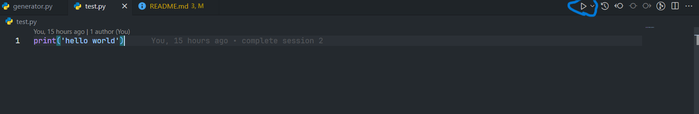

# Python BME Course 1403-404

This repository is created to provide easy access to BME students of SBU to codes and projects of TA class.

## Run Python script

You can run Python script using in two ways (currently):

1. Using run button on Visual Studio Code:  It is located on top right of the your VSCode window.

2. Run using command line: If you open your terminal on your OS(terminal in MacOS and Linux or Command Prompt or Powershell on Windows) you can run your script using this command:

```bash
python script.py # run your script
python ./folder/script.py # run with relative path of the script
python /usr/username/folder/script.py # run with full path of the script
```

## Sesssion 4: Bonus

1. Do the shifting problem(discussed in class) in the opposite direction.
    * Example: `abcdefghijk` → (Two units shifts) → `jkabcdefghi`

* Deadline: **1 week (6/2/1404)**

## Session 5: Bonus

1. Do problem `bonus.pdf`. To access click [here](./session-05/bonus.pdf).

* Deadline: **1 week (8/2/1404)**

Please send all point problems in **one .ipynb** (seperate questions if there are multiple using markdown cell) file containing **all solution** to this Telegram account: `@poorya_a_k`.

Good luck
